# Laporan Modul 3: Review 4 Pillar OOP Menggunakan Java
**Mata Kuliah:** PRAKTIKUM DESIGN PATTERN
**Nama:** MUHAMMAD LUTHFI  
**NIM:** 2024573010125
**Kelas:** TI.2A

---

## 1. Abstrak
Pada praktikum bertujuan untuk mengenalkan Apa saja hal hal  penting dalam membuat program menggunakan paradigma OOP,
mulai dari class dan object,Encapsulation,Inherintance,Polymorphism dan Abstraction.

---
## 2. Praktikum

### Praktikum 1 - Pengenalan OOP dan Class-Object
#### Dasar Teori
OOP adalah paradigma pemrograman yang berfokus pada penggunaan “objek” untuk merepresentasikan data dan fungsi-fungsi yang bekerja dengan data tersebut. Dalam pendekatan OOP, kamu memodelkan bagian-bagian program sebagai objek yang memiliki atribut (data/properti) dan method (fungsi).

Object adalah inti dari pemrograman berorientasi objek. Setiap object memiliki dua karakteristik utama yaitu memiliki atribut dan method.

Class adalah konsep abstrak yang mendefinisikan set atribut dan metode yang akan dimiliki oleh object.

#### Langkah Praktikum
1. Buat Folder module_3 
2. Lalu tambahkan package bernama bagian_1
3. Buat class java dengan nama Mahasiswa,dengan code :

        package Bagian_1;
    
    public class Mahasiswa {
    String nama;
    int umur;
    
        void displayInfo(){
            System.out.println("Nama : " + nama);
            System.out.println("umur : " + umur);
        }
    
    }

4. Buat class Java dengan nama Main sebagai implementasi class Mahasiswa dengan code :

                    package Bagian_1;
        
        public class Main {
        public static void main(String[] args){
        Mahasiswa mhs1 = new Mahasiswa();
        mhs1.nama = "Budi";
        mhs1.umur = 20;
        
                mhs1.displayInfo();
            }
        }

#### Screenshoot Hasil
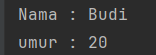
#### Analisa dan Pembahasan
Pada praktikum 1 ini kita membuat sebuah class mahasiswa dan class main yang di gunakan untuk mengimplementasi class mahasiswa dengan membuat sebuah objek yaitu mhs1 dengan atribut nama "Budi" dan umur "20".

### Praktikum 2 - Encapsulation (Enkapsulasi)

#### Dasar Teori
Encapsulation: Menyembunyikan detail internal objek dari dunia luar.
#### Langkah Praktikum
1. Tambahkan package dalam modul_3 dengan nama bagian_3
2. Tambahkan java class dengan nama Mahasiswa
3. Ketikkan code sebagai berikut :

       package Bagian_2;
    
        public class Mahasiswa {
        private String nama;
        private int umur;
    
        public String getNama(){
            return nama;
        }
    
        public void setNama(String nama) {
            this.nama = nama;
        }
    
        public int getUmur() {
            return umur;
        }
    
        public void setUmur(int umur) {
            this.umur = umur;
        }
        }
4. Lalu tambahkan class Main dengan code :

        package Bagian_2;
        
        public class Main {
        public static void main(String[] args){
        Mahasiswa mhs1 = new Mahasiswa();
        mhs1.setNama("Budiono");
        mhs1.setUmur(20);
        
                System.out.println("Nama: "+ mhs1.getNama());
                System.out.println("Umur: "+ mhs1.getUmur());
            }
        }

#### Screenshoot Hasil
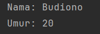
#### Analisa dan Pembahasan
Pada praktikum ini kita membahas tentang enkapsulasi dengan menggunakan 2 konsep dasar OOP yaitu akses Modifier dan setter dan Getter'

### Praktikum 3 -  Inheritance (Pewarisan) dan Composition (Komposisi)

#### Dasar Teori
Inheritance: Memungkinkan kelas baru untuk mengadopsi sifat dari kelas yang sudah ada.

Komposisi adalah sebuah hubungan antara beberapa objek di dalam pemrograman berorientasi objek (OOP) yang mana sebuah objek “memiliki” objek lain secara kepemilikan penuh.Pada hubungan ini, objek yang dimiliki tidak bisa untuk berdiri sendiri dan umur hidupnya bergantung pada objek induk.

#### Langkah Praktikum
1. Tambahkan package dalam modul_3 dengan nama bagian_3
2. Tambahkan package pewaris dalam package bagian_3
3. Tambahkan java class dengan nama Kendaraan dalam package pewaris
4. Ketikkan code sebagai berikut :

                     package Bagian_3.Pewaris;
            
         public class Kendaraan {
         String merk;
         int tahun;
            
             void displayInfo(){
                 System.out.println("merk: "+merk);
                 System.out.println("tahun: "+tahun);
             }
         }

4. Lalu tambahkan class mobil,dengan code :

       package Bagian_3.Pewaris;

        public class mobil extends Kendaraan{
        int jumlahPintu;
        void displayInfoMobil() {
            displayInfo();
            System.out.println("Jumlah Pintu: " + jumlahPintu);
    
        }
        }

5. Lalu tambahkan class Main dengan code :

        package Bagian_3.Pewaris;
        
        public class main {
        public static void main(String[] args){
        mobil mobil1 = new mobil();
        mobil1.merk = "Suzuki";
        mobil1.tahun = 2023;
        mobil1.jumlahPintu = 4;
        
                mobil1.displayInfoMobil();
            }
        }
6. tambahkan package komposisi dalam package Bagian_3
7. Tambahkan java class dengan nama mesin dalam package komposisi
8. Ketikkan code sebagai berikut :

               package Bagian_3.Komposisi;
            
         public class Mesin {
         void hidupkan(){
         System.out.println("Mesin menyala.");
         }
         void matikan(){
         System.out.println("Mesin dimatikan.");
         }
         }

9. Tambahkan java class mobil,dengan code :

        package Bagian_3.Komposisi;
        
        public class mobil {
        private final Mesin mesin;
        
            public mobil(){
                this.mesin = new Mesin();
            }
            void mulai(){
                mesin.hidupkan();
                System.out.println("Mobil siap digunakan");
            }
            void berhenti(){
                mesin.matikan();
                System.out.println(" Mobil berhenti");
            }
        }
10. Lalu tambahkan class Main dengan code :

        package Bagian_3.Komposisi;
        
        public class main {
        public static void main(String[] args){
        mobil mobil1 = new mobil();
        mobil1.mulai();
        mobil1.berhenti();
        }
        }
11. Lalu membuat fungsi main pada bagian_3 untuk menggabungkan pewaris dan komposisi,dengan code :

         package Bagian_3;

        class Mesin{
            void hidupkan(){
                System.out.println("Mesin menyala");
            }
            void matikan(){
                System.out.println("Mesin dimatikan");
            }
        }
        //Superclass utk inherintance
        class Kendaraan{
            void bergerak(){
                System.out.println("Kendaran sedang bergerak");
            }
        }
        //Subclass yang menggunakan Composition dan Inherintance
        class Mobil extends Kendaraan{
            private Mesin mesin; // composition
    
            public Mobil(){
                this.mesin = new Mesin(); // objek mesin
            }
            void mulai(){
                mesin.hidupkan();
                System.out.println("Mobil siap digunakan");
            }
            void berhenti(){
                mesin.matikan();
                System.out.println("Mobil berhenti");
            }
        }
        public class Main {
        public static void main(String[] args){
        Mobil mobil1 = new Mobil();
        mobil1.mulai();
        mobil1.bergerak();
        mobil1.berhenti();
    
            }
        }

#### Screenshoot Hasil
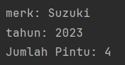

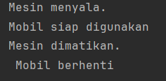

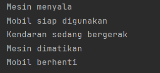

#### Analisa dan Pembahasan
Pada praktikum ini kita membahas tentang inherintance dan composition, pada praktikum pewarisan terdapat class mobil yang merupakan extend atau turunan dari
class kendaraan,pada praktikum composition terdapat class mobil yang merupakan final class dari mesin yang berarti mobil adalah class terakhir yang merupakan turunan dari mesin
dan tidak dapat membuat class lain yang mengikuti class mesin.

### Praktikum 4 - Polymorphism (Polimorfisme)

#### Dasar Teori
Polymorphism: Memungkinkan entitas untuk diinterpretasikan sebagai lebih dari satu tipe.
#### Langkah Praktikum
1. Tambahkan package dalam modul_3 dengan nama bagian_4
2. Tambahkan package dalam Bagian_4 dengan nama Overriding
2. Tambahkan java class dengan nama Hewan
3. Ketikkan code sebagai berikut :

          package Bagian_4.Overriding;

        public class Hewan {
        void bersuara(){
        System.out.println("Hewaan bersuara");
        }
        }

5. Lalu tambahkan class kucing yang mengextends class Hewan 

        package Bagian_4.Overriding;

        public class Kucing extends Hewan {
        @Override
        void bersuara(){
        System.out.println("Meong!!!");
        }
        }
6. Buat class Anjing  yang mengextends class Hewan

        package Bagian_4.Overriding;
        
        public class Hewan {
        void bersuara(){
        System.out.println("Hewaan bersuara");
        }
        }
7. Lalu tambahkan class Main dengan code :

        package Bagian_4.Overriding;
        
        public class Main {
        public static void main(String[] args){
        Hewan hewan1 = new Kucing();
        Hewan hewan2 = new Anjing();
        
                hewan1.bersuara();
                hewan2.bersuara();
            }
        }
8. Tambahkan package dalam Bagian_4 dengan nama Overloading 
9. Tambahkan java class dengan nama kalkulator,dengan code :

        package Bagian_4.Overloading;
        
        public class Kalkulator {
        int tambah( int a, int b){
        return a + b;
        }
        int tambah( int a, int b, int c) {
        return a + b + c;
        }
        double tambah( double a, double b) {
        return a + b;
        }
        }
10. Tambahkan class main di dalam package Overloading,dengan code :
        
        package Bagian_4.Overloading;
        
        public class Main {
        public static void main(String[] args){
        Kalkulator kalkulator = new Kalkulator();
        
                System.out.println("Hasil 1: "+ kalkulator.tambah(5,10));
                System.out.println("Hasil 2: "+kalkulator.tambah(5,10,9));
                System.out.println("Hasil 3: "+ kalkulator.tambah(3.5,2.5));
            }
        }

#### Screenshoot Hasil
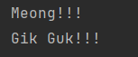

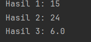

#### Analisa dan Pembahasan
Pada Praktikum ini membahas tentang Polymorphism yaitu Overriding dan Overloading,
overriding itu class anak membawa method dari class induk dengan mengubah perilaku method tersebut,
jika Overloading itu 1 class memiliki method dengan nama yang sama akan tetapi isi atau parameternya berbeda.

### Praktikum 5 -  Abstraction (Abstraksi) | Abstract Class dan Interface

#### Dasar Teori
Abstraction: Menyederhanakan kompleksitas dengan menyembunyikan detail yang tidak perlu dan hanya menampilkan fungsi esensial dari objek atau elemen pemrograman.

Interface dalam OOP adalah sebuah blueprint atau kerangka yang digunakan untuk mendefinisikan method-method (fungsi-fungsi) yang harus diimplementasikan oleh kelas lain.

#### Langkah Praktikum
1. Tambahkan package dalam modul_3 dengan nama bagian_5
2. Tambahkan package baru dalam package Bagian_5 yaitu abstrak
2. Tambahkan abstrak class dengan nama Hewan yang telah berisi class kucing dan class anjing,Ketikkan code sebagai berikut :

        package Bagian_5.abstrak;
        
        abstract class Hewan {
        String nama;
        
            void makan() {
                System.out.println(nama + " sedang makan");
            }
        
            //method abstract
            abstract void bersuara();
        }
        class Kucing extends Hewan{
        @Override
        void bersuara(){
        System.out.println("Meong!!!");
        }
        }
        class Anjing extends Hewan{
        @Override
        void bersuara(){
        System.out.println("Guk guk !!!");
        }
        }

4. Lalu tambahkan class Main,dalam package abstrak dengan code :

        package Bagian_5.abstrak;

        public class Main {
        public static void main(String[] args){
        Hewan kucing = new Kucing();
        kucing.nama  = "Kitty";
        kucing.makan();
        kucing.bersuara();
        
        Hewan anjing = new Anjing();
        anjing.nama = "Doggy";
        anjing.makan();
        anjing.bersuara();
        }
        }
5. Tambahkan package baru dalam package Bagian_5 yaitu antarmuka
6. Tambahakan java interface dengan nama Bergerak,dalam interface ini memiliki class mobil dan pesawat,dengan code :

            package Bagian_5.antarmuka;
            
            public interface Bergerak {
            void bergerak();
            
                default void berhenti(){
                    System.out.println("Berhenti bergerak.");
                }
            
                    static void info(){
                        System.out.println("ini adalah interface bergerak");
                    }
                }
            class Mobil implements Bergerak{
            @Override
            public void bergerak() {
            System.out.println("Mobil sedang melaju");
            }
            }
            
            class Pesawat implements Bergerak{
            @Override
            public void bergerak() {
            System.out.println(" Pesawat sedang terbang");
            }
            }
7. Lalu tambahkan class Main,dalam package antarmuka dengan code :

        package Bagian_5.antarmuka;
        
        public class Main {
        public static void main(String[] args){
        Bergerak mobil = new Mobil();
        mobil.bergerak();
        mobil.berhenti();
        
                Bergerak pesawat = new Pesawat();
                pesawat.bergerak();
                pesawat.berhenti();
        
                Bergerak.info();// method static dai interface
            }
        }
8. Buat class main untuk menggabungkan abstrak class dan interface, dengan code :

        package Bagian_5;
        
            interface Terbang {
            void terbang();
        }
        abstract class Hewan{
        String nama;
        abstract void bersauara();
        }
        class Burung extends Hewan implements Terbang{
        @Override
        void bersauara() {
        System.out.println("Berkicau");
        }
        @Override
        public void terbang() {
        System.out.println(nama + " sedang Terbang");
        }
        
            }
        
            public class Main {
                public static void main(String[] args){
                    Burung burung = new Burung();
                    burung.nama = "Merpati";
                    burung.bersauara();
                    burung.terbang();
                }
        }

#### Screenshoot Hasil
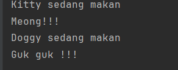

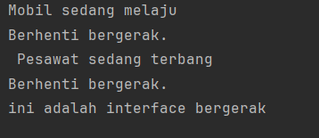

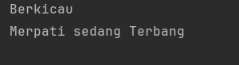

#### Analisa dan Pembahasan
Pada Bagian 5 ini membahas tentang interface dan abstract class,abstrak class menyembunyikan abstrak method yaitu bersuara yg dimana pada class kucing dan anjing method ini memiliki parameter sedangkan saat di abstrak class method ini tidak 
memiliki parameter, pada interface method harus dimplementasi oleh class lain agar dapat di definisikan.

### Praktikum 6 - Membuat Aplikasi Console Pemesanan Tiket Sederhana

#### Langkah Praktikum
1. Tambahkan package dalam modul_3 dengan nama bagian_6
2. Tambahkan abstract class dengan nama Tiket,dengan code :

        package Bagian_6;
        
        abstract class Tiket {
        private final String jenis;
        private final double harga;
        
            public Tiket(String jenis,double harga){
                this.harga = harga;
                this.jenis = jenis;
            }
            public String getJenis(){
                return jenis;
            }
        
            public double getHarga() {
                return harga;
            }
            public abstract double hitungDiskon();
        }

3. Tambahkan java class dengan nama tiketReguler,dengan code :

        package Bagian_6;
        
        public class TiketReguler extends Tiket {
        public TiketReguler(){
        super("Reguler",1000000);
        }
        
            @Override
            public double hitungDiskon() {
                return 0;
            }
        }

4. Tambahkan java class dengan nama tiketVip,dengan code:

        package Bagian_6;
        
        public class TiketVIP extends Tiket {
        public TiketVIP(){
        super("VIP",2500000);
        }
        
            @Override
            public double hitungDiskon() {
                return 0.1;
            }
        }

   5. Tambahkan java class dengan nama Pesanan,dengan code :

           package Bagian_6;
        
           public class Pesanan {
           private final String namaPemesan;
           private final Tiket tiket;
           private final int jumlah;

           public Pesanan(String namaPemesan, Tiket tiket, int jumlah){
               this.namaPemesan = namaPemesan;
               this.tiket = tiket;
               this.jumlah = jumlah;
           }
    
           public String getNamaPemesan() {
               return namaPemesan;
           }
    
           public Tiket getTiket() {
               return tiket;
           }
    
           public int getJumlah() {
               return jumlah;
           }
           public double hitungTotal(){
               double total = tiket.getHarga() * jumlah;
               double diskon = tiket.hitungDiskon() * jumlah;
               return total - diskon;
           }
           public void displayDetail(){
               System.out.println("\nDetail Pesanan");
               System.out.println("Nama Pemesan: "+ namaPemesan);
               System.out.println("Jenis tiket: "+ tiket.getJenis());
               System.out.println("Jumlah: "+ jumlah);
               System.out.println("Total Harga: RP"+ hitungTotal());
           }
           }

6. Tambahkan java class dengan nama KonferensiApp,dengan code  :

               package Bagian_6;
            
         import org.w3c.dom.ls.LSOutput;
            
         import java.util.ArrayList;
         import java.util.Scanner;
            
         public class KonferensiApp {
         private static final ArrayList<Pesanan> daftarPesanan = new ArrayList<>();
         private static final Scanner scanner = new Scanner(System.in);
            
             public static void main(String[] args){
                 while(true){
                     System.out.println("\n=== Aplikasi Pemesanan Tiket Konferensi ===");
                     System.out.println("1. Lihat Dafter Tiket");
                     System.out.println("2. Pesan tiket");
                     System.out.println("3. Lihat Detail Pesanan");
                     System.out.println("4. Batalkan Pesanan");
                     System.out.println("5. Keluar");
                     System.out.println("Pilih menu");
                     int pilihan = scanner.nextInt();
                     scanner.nextLine();// membersihkan line baru
            
                     switch (pilihan){
                         case 1:
                             lihatDafterTiket();
                             break;
                         case 2:
                             pesanTiket();
                             break;
                         case 3:
                             lihatDetailPesanan();
                             break;
                         case 4:
                             batalkanPesanan();
                             break;
                         case 5:
                             System.out.println("Terima Kasih telah menggunkan Aplikasi ini.");
                             System.exit(0);
                         default:
                             System.out.println("Pilihan tidak valid, Silahkan coba lagi");
                     }
                 }
             }
            
             private static void lihatDafterTiket(){
                 System.out.println("\n Dafter Tiket");
                 System.out.println("1. Tiket Reguler - Rp.1.000.000");
                 System.out.println("2. Tiket VIP - Rp.2.500.000");
             }
             //method untuk memesan tiket
             private static void pesanTiket(){
                 System.out.println("\n Masukkan nama pemesan: ");
                 String namaPemesan = scanner.nextLine();
            
                 System.out.println("pilih jenis tiket ( 1. Reguler, 2. VIP) : ");
                 int jenisTiket = scanner.nextInt();
                 System.out.println("Masukkan jumlah tiket: ");
                 int jumlah = scanner.nextInt();
            
                 Tiket tiket = null;
                 switch (jenisTiket){
                     case 1 :
                         tiket = new TiketReguler();
                     break;
                     case 2:
                         tiket= new TiketVIP();
                         break;
                     default:
                         System.out.println("Jenis tiket tidak valid.");
                         return;
                 }
                 Pesanan pesanan = new Pesanan(namaPemesan,tiket,jumlah);
                 daftarPesanan.add(pesanan);
                 System.out.println("Pesanan berhasil dibuat!");
                 pesanan.displayDetail();
             }
             // melihat pesanan
             private static void lihatDetailPesanan(){
                 if (isNopesanan())return;
                 System.out.println("Pilih nomor pesanan untuk melihat detail");
                 int nomorPesanan = scanner.nextInt();
                 if (nomorPesanan > 0 && nomorPesanan <= daftarPesanan.size()){
                     daftarPesanan.get(nomorPesanan - 1).displayDetail();
                 }else{
                     System.out.println("Nomor pesanan tidaak Valid");
                 }
             }
         private static boolean isNopesanan() {
         if (daftarPesanan.isEmpty()) {
         System.out.println("\n Belum ada pesanan.");
         return true;
         }
         System.out.println("\n Daftar Pesanan :");
         for (int i =0;i<daftarPesanan.size(); i++){
         System.out.println((i+1)+ "." + daftarPesanan.get(i).getNamaPemesan());
         }
         return false;
         }
            
         private static void batalkanPesanan(){
         if (isNopesanan()) return;
            
               System.out.println("pilih nomor Pesanan yang ingin di batalkan: ");
               int nomorPesanan = scanner.nextInt();
               if(nomorPesanan>0&& nomorPesanan<= daftarPesanan.size()){
                   daftarPesanan.remove(nomorPesanan - 1);
                   System.out.println("Pesanan berhasil di batalkan.");
               }else{
                   System.out.println("Nomor pesanan tidak valid.");
               }
         }
            
         }

#### Screenshoot Hasil
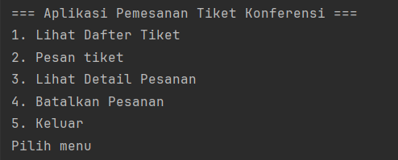
#### Analisa dan Pembahasan
Pada praktikum ini kita membuat sebuah program untuk memesan tiket dengan 2 pilihan tiket yaitu tiket reguler
dan tiket VIP dan juga dapat menampilkan detail pesanan kita'
---

## 3. Kesimpulan

Praktikum ini memberi penjelasan tentang hal hal penting dalam pemograman menggunakan OOP mulai dari class,object,enkapsulasi,penurunan,
polimorhism,abstraksi dan interface.

---

## 4. Referensi
Cantumkan sumber yang Anda baca (buku, artikel, dokumentasi) — minimal 2 sumber. Gunakan format sederhana (judul — URL).

Pengertian OOP

https://www.dicoding.com/blog/mengenal-oop-konsep-dan-contoh/

Class dan Object:

https://sko.dev/wiki/object-dan-kelas-oop/

inherintance:

https://sko.dev/wiki/object-dan-kelas-oop/

Composition:

https://medium.com/@figojulioez/komposisi-dan-agregasi-pbo-78dae3c63dd2

Polymorphism (Polimorfisme) :

https://sko.dev/wiki/object-dan-kelas-oop/

interface :

https://medium.com/@tafrikhan/interface-pada-pemrograman-berorientasi-objek-java-13381b4699cc

---