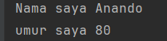
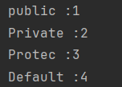
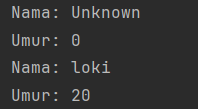

# Laporan Modul 2: Review Konsep Dasar OOP Menggunakan Java
**Mata Kuliah:** PRAKTIKUM DESIGN PATTERN
**Nama:** MUHAMMAD LUTHFI  
**NIM:** 2024573010125
**Kelas:** TI.2A

---

## 1. Abstrak
Pada praktikum bertujuan untuk mengenalkan konsep konsep dasar dari OOP sebagai dasar implementasi Desain pattern
praktikum yang di laksanakan  meliputi penguasaan struktur class dan object, penggunaan atribut dan method, penerapan access modifier (public, private, protected, dan default), serta implementasi teknik enkapsulasi melalui setter dan getter. Selain itu, praktikum ini membahas peran constructor dalam inisialisasi objek, termasuk konsep constructor overloading dan overide.

---
## 2. Praktikum

### Praktikum 1 - Class dan Object

#### Dasar Teori
Object adalah inti dari pemrograman berorientasi objek. Setiap object memiliki dua karakteristik utama yaitu memiliki atribut dan method.

Class adalah konsep abstrak yang mendefinisikan set atribut dan metode yang akan dimiliki oleh object.

#### Langkah Praktikum
1. Buat Package modul_2 dalam src
2. Lalu tambahkan package bernama bagian_1
3. Buat class java dengan nama Mahasiswa,dengan code :

    package Modul_2.Bagian_1;

    public class Mahasiswa {
        String nama;
    int umur;
    }

4. Buat class Java dengan nama Main sebagai implementasi class Mahasiswa dengan code :

               package Modul_2.Bagian_1;
            
            public class Main {
            public static void main(String[] args){
            Mahasiswa mhs1 = new Mahasiswa();
            
                    mhs1.nama= "Anando";
                    mhs1.umur=80;
            
                    // menampilkan nama dan umur
                    System.out.println("Nama saya "+ mhs1.nama);
                    System.out.println("umur saya "+ mhs1.umur);
                }
            }

#### Screenshoot Hasil

#### Analisa dan Pembahasan
Pada praktikum 1 ini kita membuat sebuah class mahasiswa dan class main yang di gunakan untuk mengimplementasi class mahasiswa dengan membuat sebuah objek yaitu mhs1 dengan atribut nama dan umur.
### Praktikum 2 - Attribute dan Method

#### Dasar Teori
Atribut adalah data yang disimpan di dalam object. Kamu bisa menganggapnya sebagai variabel yang menentukan keadaan dari sebuah object. Misalnya, dalam sebuah kelas Mobil, atribut bisa mencakup warna, merk, tipe, dll.

Metode adalah aksi yang bisa dilakukan oleh sebuah object. Ini serupa dengan fungsi dalam pemrograman. Menggunakan contoh kelas Mobil lagi, beberapa metode mungkin termasuk start(), berhenti(), berbelok(), dan lain-lain.
#### Langkah Praktikum
1. Tambahkan package dalam modul_2 dengan nama bagian_2
2. Tambahkan java class dengan nama kalkulator
3. Ketikkan code sebagai berikut :

         package Modul_2.Bagian_2;
            
         public class Kalkulator {
         int angka1;
         int angka2;
            
             int tambah() {
                 return angka1 + angka2;
             }
         }

4. Lalu tambahkan class Main,untuk mengimplementasi class Kalkulator,dengan code :

        package Modul_2.Bagian_2;
        
        public class Main {
        public static void main(String[] args){
        Kalkulator kalkulator = new Kalkulator();
        kalkulator.angka1 = 10;
        kalkulator.angka2 = 20;
        
                System.out.println("Hasil penjumlahan : "+ kalkulator.tambah());
            }
        }

#### Screenshoot Hasil

#### Analisa dan Pembahasan
Pada Praktikum ke 2 ini kita membahas atribut dan method dapat dilihat pada class kalkulator yang memiliki atribut yaitu angka1 dan angka2 dengan method Tambah yang memiliki return angka1 + angka2, sehingga saat di implementasi di 
class main dengan memberi nilai pada atribut dan di jalankan maka akan mengelurkan output hasil penjumlahan dari angka1 dan angka2.
### Praktikum 3 - Akses Modifier

#### Dasar Teori
Akses modifier adalah akses terhadap sebuah class, mau itu atribut class mau pun method class,
Akses modifier memiliki banyak jenis yaitu 

Public adalah access modifier yang paling terbuka.Ketika suatu properti, metode, atau kelas diberi access modifier public, itu berarti mereka dapat diakses oleh semua bagian dari program, termasuk dari luar kelas yang bersangkutan.

Private adalah access modifier yang paling tertutup.Jika suatu properti, metode, atau kelas diberi access modifier private, mereka hanya dapat diakses oleh anggota-anggota dalam kelas tersebut. Artinya, properti atau metode private tidak dapat diakses dari luar kelas.

Protected adalah access modifier yang berada di antara public dan private.Properti, metode, atau kelas yang diberi access modifier protected dapat diakses oleh anggota-anggota dalam kelas yang sama, serta kelas turunan (subclass) dari kelas tersebut.

Default access modifier, yang sering disebut sebagai package-private, adalah access modifier yang diterapkan secara implisit jika tidak ada access modifier yang ditentukan.
#### Langkah Praktikum
1. Tambahkan package dalam modul_2 dengan nama bagian_3
2. Tambahkan java class dengan nama AksesModifier
3. Ketikkan code sebagai berikut :
       
            package Modul_2.Bagian_3;
           
          public class AksesModifier {
          public int publicVar = 1;
          private int privateVar = 2;
          protected  int protectedVar = 3;
          int defaultVar = 4;
           
          public void tampilkan(){
              System.out.println("public :" + publicVar);
              System.out.println("Private :"+ privateVar);
              System.out.println("Protec :" + protectedVar);
              System.out.println("Default :"+ defaultVar);
          }
        }

4. Lalu tambahkan class Main,untuk mengimplementasi class AksesModifier,dengan code :

        package Modul_2.Bagian_3;
        
        public class Main {
        public static void main(String[] args){
        AksesModifier contoh = new AksesModifier();
        contoh.tampilkan();
        // privateVar tidak dapat di akses
        }
        }

#### Screenshoot Hasil

#### Analisa dan Pembahasan
Pada praktikum 3 ini kita membahas tentang aksesModifier yaitu pembatasan akses untuk sebuah class. seperti di class AksesModifier memiliki atribut dengan 4 hak akses yang berbeda,namun kenapa output atribut private dapat di tampilkan ? karena
class Main hanya menampilkan method tampilkan yang bersifat public.

### Praktikum 4 - Setter dan Getter

#### Dasar Teori
Method setter dan getter adalah dua method yang tugasnya untuk mengambil dan mengisi data ke dalam objek.
#### Langkah Praktikum
1. Tambahkan package dalam modul_2 dengan nama bagian_4
2. Tambahkan java class dengan nama Mobil
3. Ketikkan code sebagai berikut :

          package Modul_2.Bagian_4;

        public class Mobil {
        private String merk;
        //setter
        public void setMerk(String merk){
        this.merk=merk;
        }
        //getter
        public String getMerk(){
        return merk;
        }
        }

4. Lalu tambahkan class Main,untuk mengimplementasi class mobil,dengan code :

        package Modul_2.Bagian_4;
        
        public class Main {
        public static void main(String[] args){
        Mobil mobil = new Mobil();
        mobil.setMerk("Toyoyo");
        
                System.out.println("Merk Mobil :"+ mobil.getMerk());
            }
        }

#### Screenshoot Hasil

#### Analisa dan Pembahasan
Pada Praktikum ini membahas tentang getter san setter, setter dan getter terdapat dalam class mobil yaitu
setMerk (menginisialisasis atribut merk yang bersifat private agar bisa diubah isi nya ) lalu getter mengambil atribut merk yang sudah di set di setter sebelumnya.
### Praktikum 5 -  Constructor

#### Dasar Teori
konstruktor adalah metode (dengan nama yang sama dengan kelas) yang digunakan untuk membuat dan menginisialisasi objek dari kelas tersebut. Ketika kita membuat objek baru. konstruktor akan dipanggil, dan inisialisasi yang diperlukan akan dilakukan.
#### Langkah Praktikum
1. Tambahkan package dalam modul_2 dengan nama bagian_5
2. Tambahkan java class dengan nama Person
3. Ketikkan code sebagai berikut :

         package Modul_2.Bagian_5;
        
        public class Person {
        private String nama;
        private  int umur;

                // default constructor
                public Person(){
                    nama = "Unknown";
                    umur = 0;
                }
            
                public Person(String nama,int umur){
                    this.umur = umur;
                    this.nama = nama;
                }
            
                public void tampilkanInfo(){
                    System.out.println("Nama: "+ nama);
                    System.out.println("Umur: "+ umur);
                }
            
         }

4. Lalu tambahkan class Main,untuk mengimplementasi class Person,dengan code :

        package Modul_2.Bagian_5;
        
        public class Main {
        public static void main(String[] args){
        Person person1 = new Person();
        Person person2 = new Person("loki",20);
        
                person1.tampilkanInfo();
                person2.tampilkanInfo();
            }
        }

#### Screenshoot Hasil

#### Analisa dan Pembahasan
Pada Bagian 5 ini terdapat 2 constructor yaitu person dengan nilai atribut sudah di tentukan dan person dengan nilai atribut ada dalam class main.

### Praktikum 6 - Membuat sistem Manajemen Perpustakaan Sederhana 

#### Langkah Praktikum
1. Tambahkan package dalam modul_2 dengan nama bagian_6
2. Tambahkan java class dengan nama Buku
3. Ketikkan code sebagai berikut :

        package Modul_2.Bagian_6;
        
        public class Buku {
    
        private String judul;
        private String pengarang;
        private int tahunTerbit;
    
        public Buku(){
            this.judul = "Unlnown";
            this.pengarang = "unknown";
            this.tahunTerbit = 0;
        }
    
        public Buku ( String judul,String pengarang, int tahunTerbit){
            this.judul = judul;
            this.pengarang = pengarang;
            this.tahunTerbit = tahunTerbit;
        }
        // setter dan getter
        public void setJudul(String judul){
            this.judul = judul;
        }
        public String getJudul(){
            return judul;
        }
    
        public void setPengarang(String pengarang) {
                this.pengarang = pengarang;
        }
    
        public String getPengarang() {
            return pengarang;
        }
    
        public void setTahunTerbit(int tahunTerbit) {
            this.tahunTerbit = tahunTerbit;
        }
    
        public int getTahunTerbit() {
            return tahunTerbit;
        }
        public void tampilkanInfo(){
            System.out.println("Judul buku :"+ judul);
            System.out.println("Nama pengarang :"+pengarang);
            System.out.println("Tahun Terbit buku :"+ tahunTerbit);
        }
        }
4. Tambahkan class Perpustakaan,dengan code :

        package Modul_2.Bagian_6;
        
        import java.util.ArrayList;
        
        public class Perpustakaan {
        // atribut private
        private ArrayList<Buku> daftarBuku;
        // constructor
        public Perpustakaan(){
        daftarBuku = new ArrayList<>();
        }
        // method tambah buku
        public void tambahBuku(Buku buku){
        daftarBuku.add(buku);
        System.out.println("Buku Berhasil Disimpan");
        }
        public void tampilkanSemuaBuku(){
        if (daftarBuku.isEmpty()){
        System.out.println("Tidak ada buku yang tersimpan");
        }else {
        System.out.println("daftar buku:");
        for (Buku buku : daftarBuku){
        buku.tampilkanInfo();
        }
        }
        }
        // method mencari buku  berdasarkan judul
        public void cariBuku(String judul){
        boolean ditemukan = false;
        for (Buku buku : daftarBuku){
        if (buku.getJudul().equalsIgnoreCase(judul)){
        System.out.println("Buku ditemukan");
        buku.tampilkanInfo();
        ditemukan = true;
        break;
        }
        }
        if(!ditemukan){
        System.out.println("Buku dengan judul \""+ judul + "\" tidak ditemukan. ");
        }
        }
        }
5. Lalu tambahkan class Main,untuk mengimplementasi class buku dan perpustakaan,dengan code :

            package Modul_2.Bagian_6;
            
            import java.util.Scanner;
            
            public class Main {
            public static void main(String[] args){
            Scanner scanner = new Scanner(System.in);
            Perpustakaan perpustakaan = new Perpustakaan();
            int pilihan;
            
                    do {
                        // Menu
                        System.out.println("\n=== Sistem Manajemen Perpustakaan ===");
                        System.out.println("1. Tambah Buku");
                        System.out.println("2. Tampilkan Buku");
                        System.out.println("3. Cari Buku");
                        System.out.println("4. Keluar");
                        System.out.println("4. Pillih menu");
                        pilihan = scanner.nextInt();
                        scanner.nextLine();
            
                        switch (pilihan){
                            case 1:
                                //Tambah buku
                                System.out.println("Masukkan judul buku");
                                String judul = scanner.nextLine();
                                System.out.println("Masukkan nama pengarang");
                                String pengarang = scanner.nextLine();
                                System.out.println("Masukkan tahun terbit");
                                int tahunTerbit = scanner.nextInt();
                                scanner.nextLine();
            
                                Buku bukuBaru = new Buku(judul,pengarang,tahunTerbit);
                                perpustakaan.tambahBuku(bukuBaru);
                                break;
            
                            case 2:
                                //tampilkan semua buku
                                perpustakaan.tampilkanSemuaBuku();
                                break;
            
                            case 3 :
                                System.out.println("Masukkan judul buku yang ingin di cari: ");
                                String judulCari = scanner.nextLine();
                                perpustakaan.cariBuku(judulCari);
                                break;
            
                            default:
                                System.out.println("Pilihan tidak ada, coba lagi");
                        }
                    } while (pilihan!=4);
                    scanner.close();
                }
            }

#### Screenshoot Hasil

#### Analisa dan Pembahasan
Pada praktikum ini kita membahas tentang cara-cara untuk membuat sebuah sistem untuk memanajemen Perpustakaan Sederhana
dengan menggunakan Konsep konsep dasar OOP yang sudah di bahas sebelumnya
---

## 3. Kesimpulan

Praktikum ini memberi pengenalan tentang konsep dasar OOP dan implementasiannya dalam code java 
dan penggabungan antara konsep konsep dasar OOP dalam praktikum di bagian 6

---

## 4. Referensi
Cantumkan sumber yang Anda baca (buku, artikel, dokumentasi) — minimal 2 sumber. Gunakan format sederhana (judul — URL).

Class dan Object:

https://sko.dev/wiki/object-dan-kelas-oop/

Attribute dan Method:

https://sko.dev/wiki/object-dan-kelas-oop/

Akses Modifier:

https://blog.ruangdeveloper.com/access-modifier-pada-pemrograman-berbasis-objek/

Setter dan Getter:

https://www.petanikode.com/java-oop-setter-getter/

Constructor:

https://www.enjoyalgorithms.com/blog/constructors-in-java

---